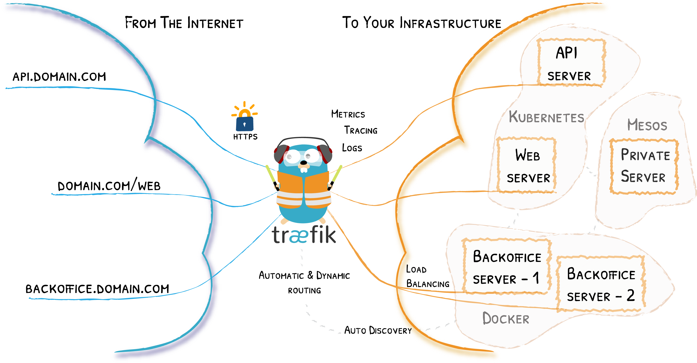

# 今日分享 #001 - Traefik V3.0 正式版发布

> 一起成长: 进入分享群，每日分享新技术、新资讯，每天 1 分钟，帮助你强制学习，1 年就算 365 个知识点，助你早日成为大神，财务自由。
扫码添加我微信，备注「今日分享」，拉你进微信群。

> Traefik Proxy V3.0 正式版发布；Douyin - 模仿版的抖音；SadTalker - 基于音频驱动的单幅图像对话头像动画生成项目；EasyTier - 一款易用、功能丰富、去中心化的异地组网工具;

## 🛠 Go

### Traefik Proxy V3.0 正式版发布

支持 WebAssembly 和 Kubernetes Gateway API

文章：https://mp.weixin.qq.com/s/j-35ZN8GRNKKE4D1qhFzpw

## 📘 前端

### Douyin - 模仿版的抖音

基于Vue3、Pinia 和 Vite5 开发的，高度还原了抖音的核心功能，包括视频播放、评论、点赞、关注等，并提供了丰富的扩展功能，例如页面缓存、数据模拟等。

GitHub: https://github.com/zyronon/douyin

## 🤖 AIGC

### SadTalker - 基于音频驱动的单幅图像对话头像动画生成项目

它可以将单幅人像图像与音频结合，生成逼真的视频对话头像。

GitHub: https://github.com/OpenTalker/SadTalker

## 🦀 Rust

### EasyTier - 一款易用、功能丰富、去中心化的异地组网工具

与 ZeroTier、TailScale 等方案相比，EasyTier 采用去中心化设计，消除了传统组网中的客户端、服务端、中继服务器等概念，简化了部署流程。并且不仅提供命令行工具，也基于 Tauri 实现了跨平台的 GUI 支持。
EasyTier 通过自研的链路状态路由协议高效交换路由信息；支持 UDP、TCP、WireGuard 等多种建链方式和基于 AES-GCM 的数据加密；支持多种 NAT 穿透方式；并且实现了子网路由、WireGuard Portal 等高级功能。

GitHub: https://github.com/KKRainbow/EasyTier
