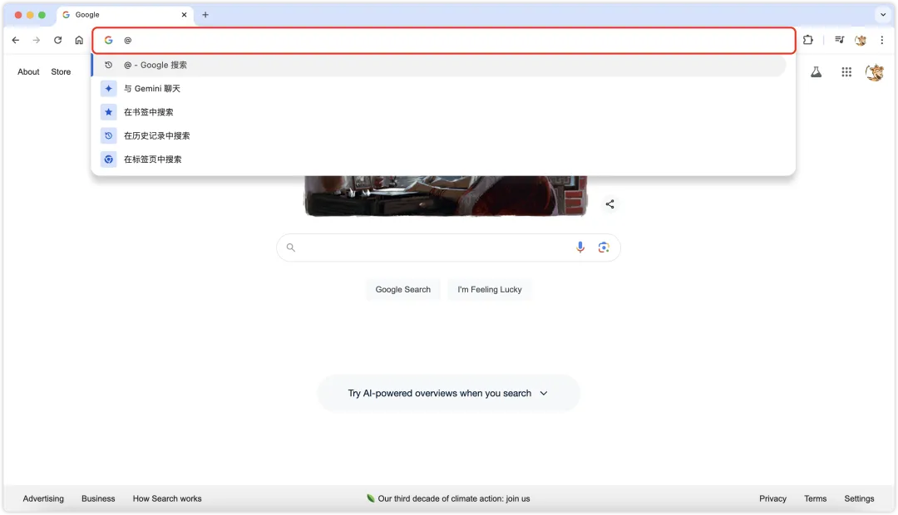

# 今日分享 #001 - Google Chrome 一键使用 Gemini

> 一起成长: 进入分享群，每日分享新技术、新资讯，每天 1 分钟，帮助你强制学习，1 年就算 365 个知识点，助你早日成为大神，财务自由。
扫码添加我微信，备注「今日分享」，拉你进微信群。

> Google Chrome 一键使用 Gemini；Digger - 一个开源的 IaC 编排工具；tsx - 让 Node.js 直接执行 TypeScript 和 ESM

## 🛠 Go

### Digger - 一个开源的 IaC 编排工具

它允许你在现有的 CI 流水线管道中运行 IaC。Digger 的优势在于，它可以在你的 CI 中原生运行 terraform，这样做既安全，因为云访问密钥不会与第三方共享，又经济，因为你不需要为运行 terraform 支付额外的计算费用。

GitHub：https://github.com/diggerhq/digger

## 📘 前端

### tsx - 让 Node.js 直接执行 TypeScript 和 ESM

解决 TypeScript 需要执行编译成 JavaScript 才能在 Node.js 中执行的问题。

GitHub: https://github.com/privatenumber/tsx

## 🤖 AIGC

### Google Chrome 一键使用 Gemini

昨天的文章刚说到 Gemini的一些更新，这不，Google Chrome 又一项突破性更新，该更新通过简单的“@”符号启用，可以直接访问智能AI助手Gemini。

https://mp.weixin.qq.com/s/e07cgcLCSpm_NflVAPUXhQ
