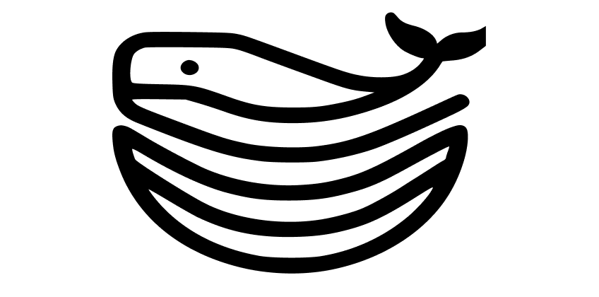

# 今日分享 #003 - 开源版 Vercel，应用云托管 PaaS 平台

> 一起成长: 进入分享群，每日分享新技术、新资讯，每天 1 分钟，帮助你强制学习，1 年就算 365 个知识点，助你早日成为大神，财务自由。
扫码添加我微信，备注「今日分享」，拉你进微信群。

> Gitness - 开源的 GitOps 开发者平台；Dokploy - 开源版 Vercel，应用云托管 PaaS 平台；国产Sora竞争关键，在创意、工作流和垂直场景

## 🛠 Go

### Gitness - 开源的 GitOps 开发者平台
9okio0
Gitness 是一个开源的 GitOps 开发者平台，它集成了代码管理、持续集成和持续交付 (CI/CD) 的功能，帮助开发者更轻松地管理代码、构建和部署应用程序。
Gitness 使用 Go 和 Node.js 构建，用户可以本地安装或在 Docker 容器中运行它。

GitHub: https://github.com/harness/gitness

## 📘 前端

### Dokploy - 开源版 Vercel，应用云托管 PaaS 平台

Dokploy是一个免费的、可自我托管的平台即服务（PaaS）解决方案。它简化了应用程序和数据库的部署和管理。Dokploy允许开发者在任意的虚拟私有服务器（VPS）上高效、安全地部署应用程序。其主要特性包括整合Traefik，实时监控，数据库备份等。透过Dokploy，开发者可以更方便地进行各种应用的部署和维护，大大提高开发效率和系统的稳定性。

GitHub： https://github.com/Dokploy/dokploy

## 🤖 AIGC

### 国产 Sora 竞争关键，在创意、工作流和垂直场景 

AI加持，只用半天，就能做出时长60秒的惊艳短片；面对越来越激烈的竞争，创意超越现实、工作流的整合、垂直场景能力这三点非常关键；垂直模型的创新，有两年左右的窗口期；美图不做大而全的模型和场景，更关注垂直的图像和视频模型及场景。

文章：https://mp.weixin.qq.com/s/TFvwXWsC9k76OyO_5FD_JA
