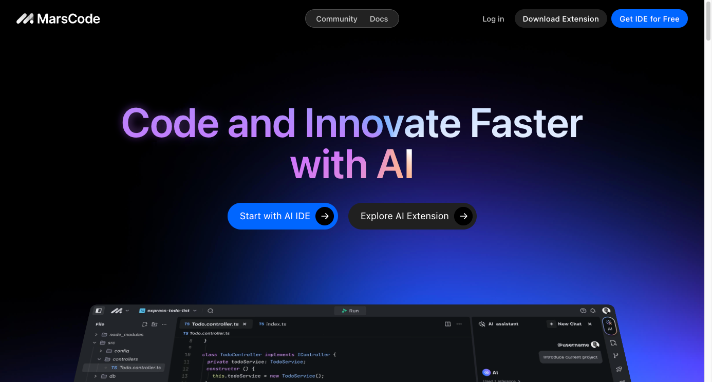

# 今日分享 #006 - MarsCode - 字节新推出的WebIDE

> 一起成长: 进入分享群，每日分享新技术、新资讯，每天 1 分钟，帮助你强制学习，1 年就算 365 个知识点，助你早日成为大神，财务自由。
扫码添加我微信，备注「今日分享」，拉你进微信群。

> MarsCode - 字节新推出的WebIDE；Awesome-Team-Build - 组件一个 MVP 团队的资源；DeepSeek-V2 - 国产开源 MoE 指标炸裂，GPT-4 级别能力，API 价格仅百分之一；Gost - 一个用 GO 语言实现的安全隧道；Soybean Admin - 后台管理模

## 🛠 Go

### Gost - 一个用 GO 语言实现的安全隧道

它具有多端口监听、可设置转发代理、支持多种隧道类型、SNI 代理等功能。

GitHub: https://github.com/ginuerzh/gost

## 📘 前端

### Soybean Admin - 后台管理模板

一个基于 Vue3、Vite3、TypeScript、NaiveUI、Pinia 和 UnoCSS 的清新优雅的中后台模版。它使用最新流行的前端技术栈，内置丰富的主题配置，有着极高的代码规范。

GitHub: https://github.com/honghuangdc/soybean-admin

## 🤖 AIGC

### DeepSeek-V2 - 国产开源 MoE 指标炸裂，GPT-4 级别能力，API 价格仅百分之一

DeepSeek-V2 性能达 GPT-4 级别，但开源、可免费商用、API 价格仅为 GPT-4-Turbo 的百分之一。从公布的性能指标来看，DeepSeek-V2 的中文综合能力超越一众开源模型，并和 GPT-4-Turbo、文心 4.0 等闭源模型同处第一梯队。英文综合能力也和 LLaMA3-70B 同处第一梯队，并且超过了同是 MoE 的 Mixtral 8x22B。

https://www.jiqizhixin.com/articles/2024-05-07-3

### 我如何夺冠新加坡首届 GPT-4 提示工程大赛

1. 借助 CO-STAR 框架构建高效的提示
2. 利用分隔符来分节构建提示
3. 设计含有 LLM 保护机制的系统级提示
4. 仅依靠大语言模型分析数据集，无需插件或代码  — 实际案例分析 Kaggle 的真实数据集

https://baoyu.io/translations/prompt-engineering/how-i-won-singapores-gpt-4-prompt-engineering-competition

## 🚀 其他

### Awesome-Team-Build - 组件一个 MVP 团队的资源

包括日常通信、资源共享、生产力工具、项目协作、产品需求、设计协作、开发协作、开发模式、DevOps、运营分析等

GitHub: https://github.com/whatwewant/awesome-team-build

### MarsCode - 字节新推出的WebIDE

集成了 AI 能力，同时推出了 VSC 和 JetBrains 的插件。

官网: https://marscode.com

### Healthchecks - 一款简单高效的任务执行监控系统（Python）

非常适合 Cron 任务或者类似 Cron 的系统（比如Jenkins 定时构建、K8S CronJob等），对现有任务设置无侵入，当任务未执行时，Healthchecks 会记录执行情况，并且发出多种告警通知。

Github：https://github.com/healthchecks/healthchecks
