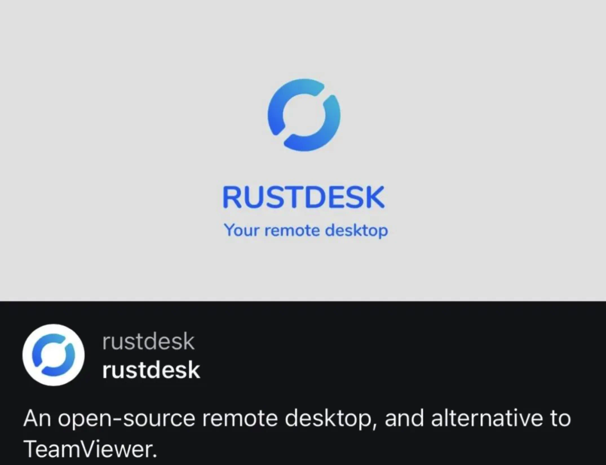

# 今日分享 #007 - 知名远程控制工具、TeamViewer开源替代 - RustDesk 已暂停国内服务

> 一起成长: 进入分享群，每日分享新技术、新资讯，每天 1 分钟，帮助你强制学习，1 年就算 365 个知识点，助你早日成为大神，财务自由。
扫码添加我微信，备注「今日分享」，拉你进微信群。

> Gotenberg - 基于 Docker 的无状态 PDF 创建服务；uikit - 基于 three.js 的 3D 组件库；OpenAI神秘模型，再次被Sam Altman提及；知名远程控制工具、TeamViewer开源替代——RustDesk已暂停国内服务

## 🛠 Go

### Gotenberg - 基于 Docker 的无状态 PDF 创建服务

只需要一个接口服务，你就可以将任何文件或者连接转换为 PDF。

GitHub: https://github.com/gotenberg/gotenberg

## 📘 前端

### uikit - 基于 three.js 的 3D 组件库

使用 @react-three/fiber 和 Yoga，为 three.js 构建高性能 3D 用户界面，并支持嵌套滚动、按钮、输入、下拉菜单、选项卡、复选框等。

GitHub: https://github.com/pmndrs/uikit

### React 周刊 - React 19 版本发布

本期介绍了 React 19 Beta 版的新特性，包括支持自定义元素、增强的异步事务处理能力、以及原生元数据标签的渲染等新特性。同时，提供了详细的升级指南帮助开发者顺利过渡。工具方面介绍了 extension.js 用于简化浏览器扩展开发，Divz 用于增强 3D 交互。此外，还有关于 React-Spring 动画库的可视化工具介绍，帮助开发者更好地理解和应用动画效果。

文章：https://mp.weixin.qq.com/s/S-lt3E177jGRWJ5yYJ6QjA

## 🤖 AIGC

### OpenAI神秘模型，再次被Sam Altman提及

5月6日，OpenAI首席执行官Sam Altman在社交平台分享了一条推文“我是一个优秀的GPT-2聊天机器人”。
而在4月30日，Altman就提起过该模型非常喜欢GPT-2。按道理说一个只有15亿参数在2019年发布的开源模型，被反复提及两次就很不寻常。

文章：https://mp.weixin.qq.com/s/6JgHlShBMiZ8UYInLr6vVg

## 🚀 其他

### 知名远程控制工具、TeamViewer开源替代 - RustDesk 已暂停国内服务

RustDesk 是中国开发者创造的开源远程控制工具，其作者宣布：“为了进一步应对诈骗，我们暂时决定停止中国地区的服务，如果用户现在通过公共服务器访问国内主机，将会收到被禁止的消息。”

文章：https://mp.weixin.qq.com/s/kKjryRRTznUYisYaFYxySA

### [Java] sensitive-word - 高性能敏感词过滤框架

一个基于 DFA 算法实现的高性能敏感词过滤工具框架。通过 sensitive-word 框架可以方便地进行高效准确地敏感词过滤。

GitHub: https://github.com/houbb/sensitive-word

### [Python] rustdesk-api-server - 基于Django的 RustDesk Api 和 Web Server

除了支持api所有功能，还支持web注册、管理、展示等。已支持到最新1.2.3版本。

GitHub: https://github.com/kingmo888/rustdesk-api-server
