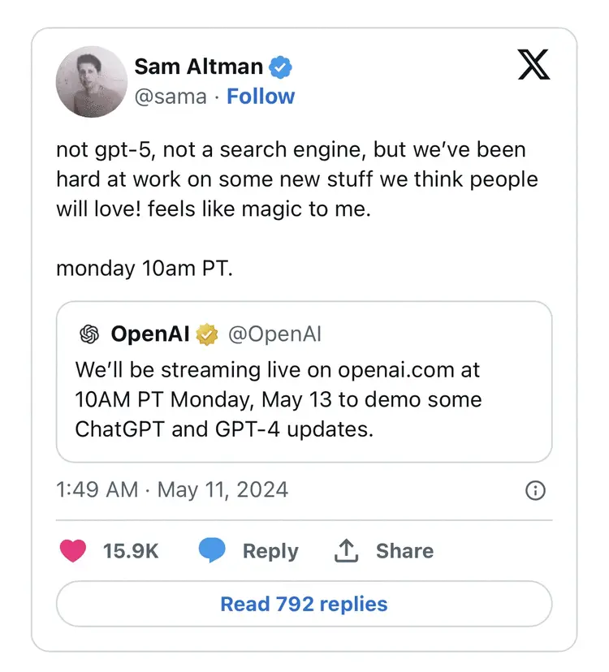

# 今日分享 #010 - OpenAI 官宣下周一发布产品更新，但不会涉及 GPT-5 和搜索引擎

> OpenAI 官宣下周一发布产品更新，但不会涉及 GPT-5 和搜索引擎；手把手教你创造你的本地私人 ChatGPT（上）：本地大模型 Ollama；告别 React，拥抱 Svelte：21天重写应用，开发速度翻倍代码量减半；v8go - Execute JavaScript from Go：Terraform 1.8 发布

## 🛠 Go

### v8go - Execute JavaScript from Go

Go 实现的 JavaScript 引擎，底层基于 Google Chrome v8 内核执行 JavaScript。

GitHub: https://github.com/tommie/v8go

## 📘 前端

### 告别 React，拥抱 Svelte：21天重写应用，开发速度翻倍代码量减半

在软件开发的大潮中，重写项目常常被视为一项既常见又充满挑战的任务。本文作者结合自身多年的实战经验，深入剖析了前端与后端重写之间的异同，并特别分享了从 React 向 Svelte 迁移的历程，其中遇到的种种难题与收获均一一呈现。通过对比 Svelte 与 React 在性能、开发速度及开发者满意度等方面的表现，作者认为 Svelte 具有成为新项目首选框架的潜力，并分享了自己对 Svelte 的独特见解与热切期待。此外，文章还着重强调了项目重写的必要性及其所面临的挑战，同时列举了一些成功的重写案例与失败的教训。若你对软件重写、前端框架的选择以及 Svelte 的优势抱有浓厚兴趣，那么本文定能为你带来深刻的见解与启发。

https://mp.weixin.qq.com/s/jpQZdUWAYYKBRIabaamkbQ

## 🤖 AIGC

### 手把手教你创造你的本地私人 ChatGPT（上）：本地大模型 Ollama

近年来，人工智能技术发展迅猛，其中大型语言模型（LLM）的进步尤为引人注目。LLM 拥有海量的参数和强大的学习能力，能够执行各种复杂任务，例如生成文本、翻译语言、编写不同类型的创意内容等等。以往，想要体验 LLM，通常需要将模型部署到云端，这对于个人用户来说门槛较高，且成本不菲。现在，Ollama 的出现打破了这一限制。

https://mp.weixin.qq.com/s/JfC-bZRfeAtM7OG2dHD2rg

### OpenAI 官宣下周一发布产品更新，但不会涉及 GPT-5 和搜索引擎

5月10日，OpenAI表示，将于5月13日（下周一）上午10点在其官网进行直播，届时将演示一些ChatGPT和GPT-4更新。不过，OpenAI首席执行官萨姆·奥尔特曼在X上转发了公司这条帖子，并补充道：“不是GPT-5，也不是搜索引擎，但我们一直在努力开发一些我们认为人们会喜欢的新东西！对我来说感觉就像魔术一样神奇。”奥尔特曼的帖子在某种程度上回应了路透社早些时候的报道。路透社此前报道称，OpenAI计划于下周一发布一款由AI驱动的搜索引擎产品，与搜索引擎霸主和AI搜索初创公司Perplexity展开竞争。不过，报道也指出，公布的日期可能会有变化。

https://m.163.com/news/article/J1T37PF500097U7T.html

## 🚀 其他

### [云原生] Terraform 1.8 发布

HashiCorp 发布了 Terraform 1.8 版本，这是他们的基础设施即代码语言。该版本引入了提供者定义的函数。这使得能够在给定的提供程序中创建处理计算型任务的自定义函数。包括 AWS、GCP 和 Kubernetes 在内的多家提供商在该版本中引入了新的提供商定义的函数。 1.8 版还引入了跨资源类型重构的改进。

https://www.infoq.com/news/2024/05/terraform-provider-functions/

## 一起成长

> 一起成长: 进入分享群，每日分享新技术、新资讯，每天 1 分钟，帮助你强制学习，1 年就收获 365 个知识点，助你早日成为大神，财务自由。
扫码添加我微信，备注「今日分享」，拉你进微信群。

