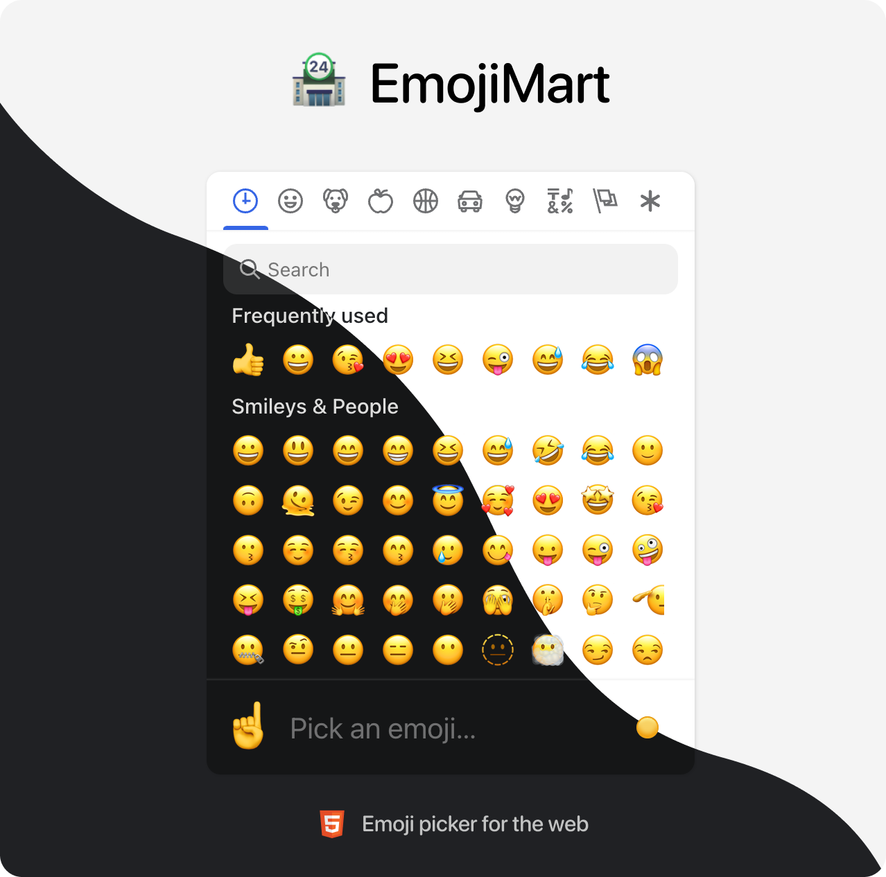

# 今日分享 #011 - 你想要的 emoji 都在 emoji 商店 emoji-mart 里

> 国产大模型：今天起，我们 100 万 tokens 只需 1 元；emoji-mart - emoji 商店组件；Go 与 Rust：未来的软件开发大比拼

## 🛠 Go

### Go 与 Rust：未来的软件开发大比拼

Go 语言和 Rust 语言作为现代编程语言，在软件开发领域有着广泛的应用和不小的影响力。它们各自的特点、优势和适用场景各异，也各自拥有一批忠实的拥护者。本文将详细探讨这两种语言的设计哲学、性能特点、使用场景以及未来发展趋势。

https://mp.weixin.qq.com/s/Kbn7rgvgIqjILqg8X3W_iA

## 📘 前端

### emoji-mart - emoji 商店组件

提供大量 emoji，方便你快速使用。

GitHub: https://github.com/missive/emoji-mart

## 🤖 AIGC

### 国产大模型：今天起，我们 100 万 tokens 只需 1 元

昨天刚刚在顶会ICLR作为特邀演讲（Invited Talk）中“国内唯一”的大模型玩家智谱AI，今天又放出了一个好消息：现在我家的大模型开放平台，1元=1000000 tokens！

什么概念呢？相当于花1元钱就能写1万条小红书（以350字计算）。

https://mp.weixin.qq.com/s/YjFpVe_6MOxIztpU6F1AFg

## 一起成长

> 一起成长: 进入分享群，每日分享新技术、新资讯，每天 1 分钟，帮助你强制学习，1 年就收获 365 个知识点，助你早日成为大神，财务自由。
关注微信公众号，扫码添加我微信，备注「今日分享」，拉你进微信群。

