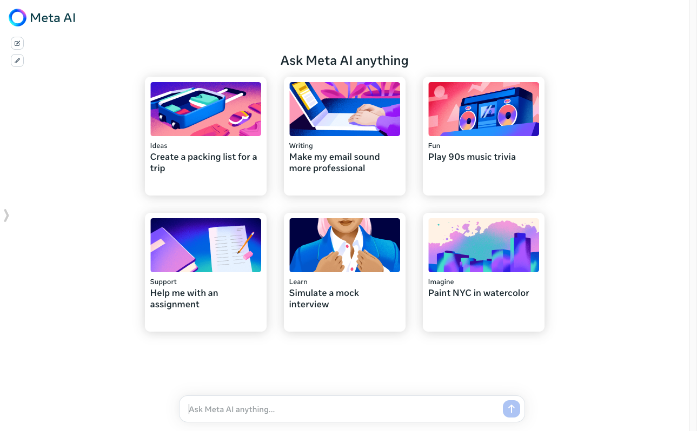

# 今日分享 #012 - Meta 公司发布自家的 AI 服务

> Melody - 打造实时应用的 WebSocket 框架；vue-styled-components - 面向 Vue 的 CSS-in-JS 库；Meta AI - Meta 公司发布自家的 AI 服务；DocKit - Elasticsearch 的跨平台桌面客户端；Briefcase - 一键将Python项目转化为macOS、Windows、Linux、iOS和Android应用的利器

## 🛠 Go

### Melody - 打造实时应用的 WebSocket 框架

Melody 是基于 github.com/gorilla/websocket 的WebSocket框架，它提供非常精简而又具备强大功能的接口。Melody框架的核心理念是为了让你的Websockets处理更加简单和高效，从而可以让开发者更专注于应用的业务逻辑。

GitHub: github.com/olahol/melody

## 📘 前端

### vue-styled-components - 面向 Vue 的 CSS-in-JS 库

一款类似 styled-components 的 CSS 工具，支持 Vue3。

GitHub: https://github.com/v-vibe/vue-styled-components

## 🤖 AIGC

### Meta AI - Meta 公司发布自家的 AI 服务

免费使用，基于 Llama 3 模型，可以"文生文"和"文生图"，效果不错，详见 Meta 的官方介绍文章。

https://www.meta.ai/

## 🚀 其他

### [JAVA] DocKit - Elasticsearch 的跨平台桌面客户端

同时支持 OpenSearch，集成了 OpenAI，可以用自然语言与数据库交互。

GitHub: https://github.com/geek-fun/dockit

### [Python] Briefcase - 一键将Python项目转化为macOS、Windows、Linux、iOS和Android应用的利器

通过 Briefcase，开发人员可以简化应用程序的部署过程，实现一次编写、多平台运行。Briefcase 的可扩展性使开发人员能够根据项目需求添加更多的平台和安装格式支持。通过 Briefcase 的简单易用性、跨平台支持和丰富的生态系统，开发人员可以更高效地构建和部署 Python 应用程序。无论是开发桌面应用、移动应用还是 Web 应用，Briefcase 都是一个值得推荐的工具。

GitHub: https://github.com/beeware/briefcase

## 一起成长

> 一起成长: 进入分享群，每日分享新技术、新资讯，每天 1 分钟，帮助你强制学习，1 年就收获 365 个知识点，助你早日成为大神，财务自由。
关注微信公众号，扫码添加我微信，备注「今日分享」，拉你进微信群。

