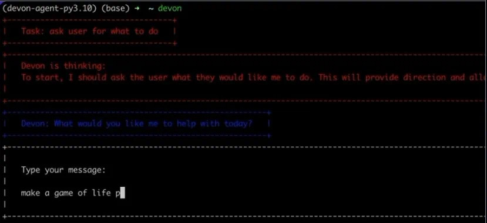

# 今日分享 #019 - 开源的 AI 编程助手 Devon

> Devon - 一个开源的编程助手；River - 高性能作业处理（Job Processing）系统；QR code designer - QRCode 设计工具

## 🤖 AIGC

### Devon - 一个开源的编程助手

旨在帮助开发者更高效地编程和管理代码库。使用Devon可以在很多情况下帮助你，比如当你需要编写代码、探索代码库、编写配置文件、编写测试、修复BUG或者探索软件架构的时候。Devon能够编辑多个文件，从而在整个代码库中提供帮助。然而，它主要针对Python语言，对于非Python语言的支持则有限。

GitHub: https://github.com/entropy-research/Devon

## 🛠 Go

### River - 高性能作业处理（Job Processing）系统

它底层基于 Postgres，鼓励应用数据和作业队列使用相同的数据库。通过以事务方式将作业与其他数据库更改一起排队，可以避免整个类别的分布式系统问题。如果事务提交，作业将被保证排队；如果事务回滚，作业将被删除；并且在提交之前对工作不可见 。

GitHub: https://github.com/riverqueue/river

## 📘 前端

### QR code designer - QRCode 设计工具

一个 Web 工具，用来设计二维码，可以嵌入各种文字和图形。

GitHub: https://github.com/kochrt/qr-designer

## 一起成长

> 一起成长: 进入分享群，每日分享新技术、新资讯，每天 1 分钟，帮助你强制学习，1 年就收获 365 个知识点，助你早日成为大神，财务自由。
关注微信公众号，扫码添加我微信，备注「今日分享」，拉你进微信群。

