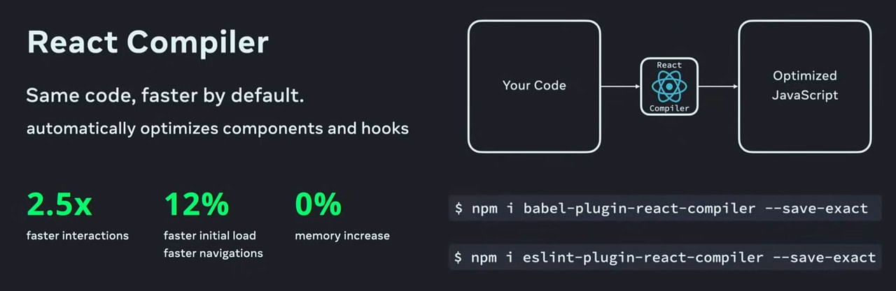

# 今日分享 #024 - React Compiler 来啦

> Microsoft Power Automate - 微软 AI 语音自动化操作助手；ants - 一个高性能且低损耗的 goroutine 池；React Compiler 来啦

## 🤖 AIGC

### Microsoft Power Automate - 微软 AI 语音自动化操作助手

微软发布了新版 Power Automate，带来了全新的AI驱动自动化体验。
用户只需通过屏幕分享和语音描述操作步骤，AI便能自动学习并生成工作流程，从而实现自动化任务处理。

https://powerautomate.microsoft.com/en-us/blog/revolutionize-the-way-you-work-with-automation-and-ai/

## 🛠 Go

### ants - 一个高性能且低损耗的 goroutine 池 

实现了对大规模 goroutine 的调度管理、goroutine 复用，允许使用者在开发并发程序的时候限制 goroutine 数量，复用资源，达到更高效执行任务的效果。

GitHub: https://github.com/panjf2000/ants

## 📘 前端

### React Compiler 来啦

上周 React Conf 上，最大的亮点就是开源了 React Compiler，它是优化 React 构建速度的底层工具库。从今天开始，面试流程将加入“React Compiler”的原理与实现？

https://react.dev/learn/react-compiler

## 一起成长

> 一起成长: 进入分享群，每日分享新技术、新资讯，每天 1 分钟，帮助你强制学习，1 年就收获 365 个知识点，助你早日成为大神，财务自由。
关注微信公众号，扫码添加我微信，备注「今日分享」，拉你进微信群。

