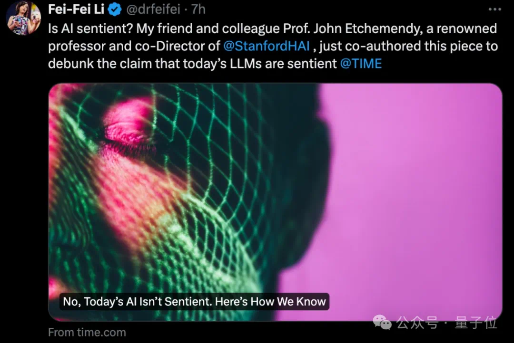

# 今日分享 #024 - 李飞飞：大模型不具备知觉，参数再多也不行

> 李飞飞：大模型不具备知觉，参数再多也不行；tinymath - 快速高效的数学运算库，适用于 WebAssembly 场景；浏览器节能机制导致Websocket断连的巨坑

## 🤖 AIGC

### 李飞飞：大模型不具备知觉，参数再多也不行

我们还没有实现有知觉的人工智能，更大的语言模型也无法帮助我们实现这一目标。
我们不会在下一个版本的ChatGPT中偶然发现知觉。

https://mp.weixin.qq.com/s/j7_P2PO4ydPARuG1z8IL4A

## 🛠 Go

### tinymath - 快速高效的数学运算库，适用于 WebAssembly 场景

GitHub: https://github.com/orsinium-labs/tinymath

## 📘 前端

### 浏览器节能机制导致Websocket断连的巨坑

近期，在使用WebSocket（WS）连接时遇到了频繁断连的问题，这种情况在单个用户上每天发生数百次。尽管利用了socket.io的自动重连机制能够在断连后迅速恢复连接，但这并不保证每一次重连都能成功接收WS消息。因此，我们进行了一些的排查和测试工作。
最终发现问题的根本原因：正是浏览器的节能机制，不经意间成为了这一问题的幕后黑手。

https://mp.weixin.qq.com/s/GynjyLLMYl1NMaA6OONIBA

## 一起成长

> 一起成长: 进入分享群，每日分享新技术、新资讯，每天 1 分钟，帮助你强制学习，1 年就收获 365 个知识点，助你早日成为大神，财务自由。
关注微信公众号，扫码添加我微信，备注「今日分享」，拉你进微信群。

